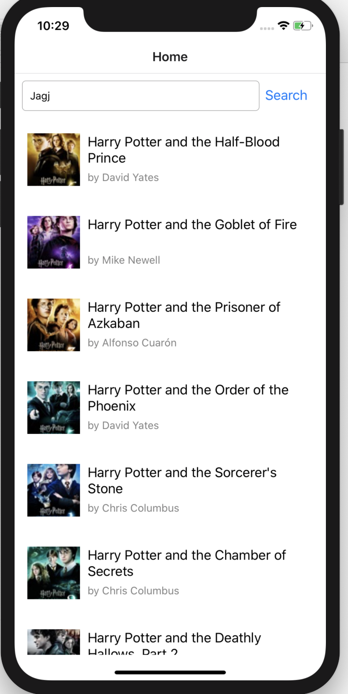
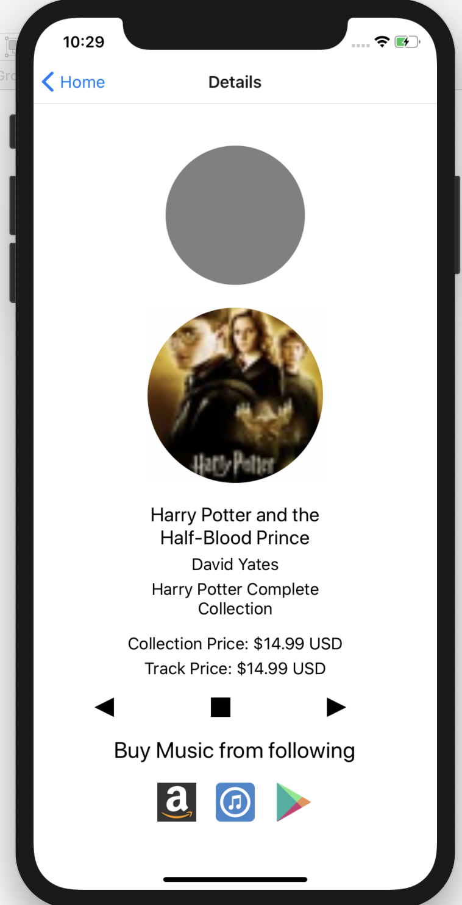
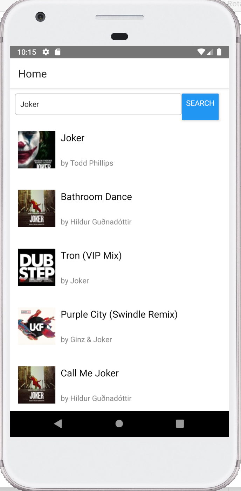
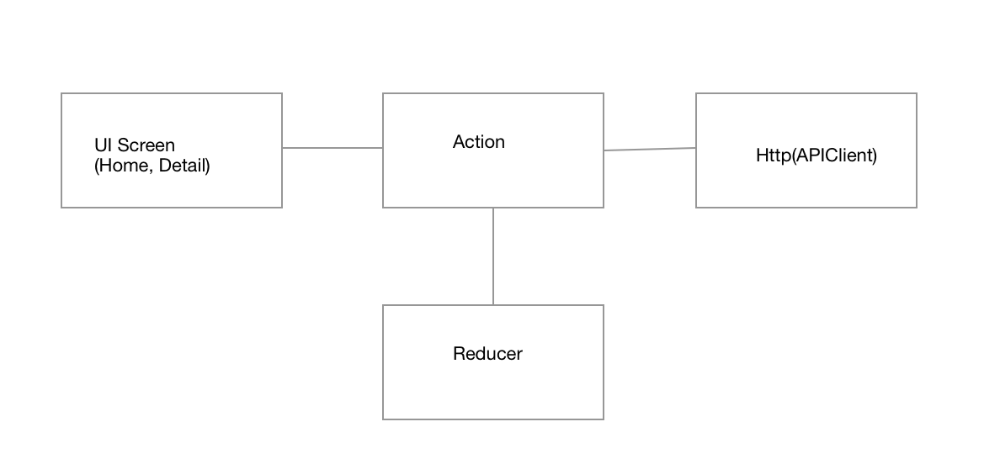

# Music Play
app allows user to search for music and play music and go to next music and previous music.
###### app installatiomn
  - project folder run npm install
  - cd ios and pod install
  - cd .. go back to project folder
  - react-native run-ios (For ios)
  - react-native run-android (For android)

###### iOS screenshots
  
    

###### android screenshots
  

###### App architecture
- App is using UMCore and unimodules for using expo-av
- expo-av is only used for android for playing audio
- For iOS app is using iOS native component AudioVisualizer for playing audio and music power level visualization is rendered in UIView in iOS native 
- src folder has react native js code
- Redux, Action, Reducer are used to store and retreive data
- Screens folders are used for UI all UI screen
- Http folder is used for making API request
- Test folder is used for running jest enzyme test cases

###### testing
- Home.test.js: UI snapshot testing, Actions snapshots testing, count number of MusicItem loaded on Home screen
- Details.test.js: UI snapshot testing. Due some reason while running test it cannot import module

###### Time spent
I spent 15-20 mins in sketching the UI/UX
I spent around 6 hours of time writing code
I spent around 4 hours of time in testing and covered all unit testing

###### Challenging part
Challenging part of application was to add visualization for iOS and configuring project for expo-av, setting up Jest testing

